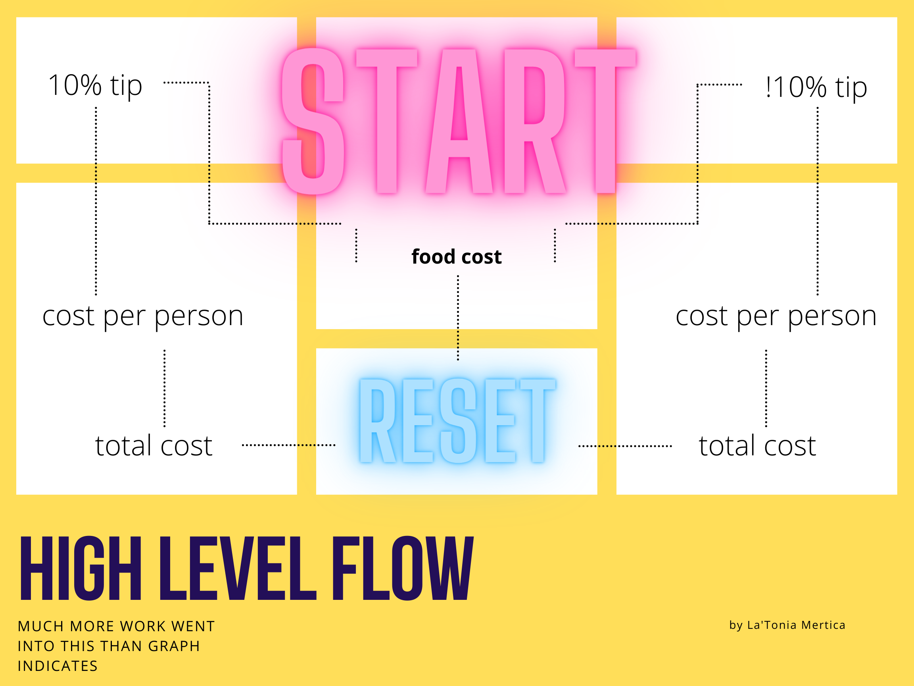

# 
**JUSTICE THROUGH CODE**

###### PYTHON BOOTCAMP FALL 2021 COHORT
 

#### **FIRST NAME: La'Tonia Mertica**
###### note_1: pronounced *luh tone yuh merr treece*

---
###### <a href="https://drive.google.com/file/d/1NJNd3XmIWNVadYwVB_OCQQDDXzNVvn1X/view?usp=sharing" target="_blank"> visit pdf technical question guide by La'Tonia Mertica</a>
 

## **TIP CALCULATOR**
*enter food cost to start tip calculation(s), follow prompts through the 'y' flow or the 'n' flow ... or, be routed to the welcome screen to start over (i.e. non-y/n input when prompted) .. . view cost per person before tax, be prepared for mandatory 10% tax, and view total cost after tax ...*
 
 

 

## **SUDO CODE: HIGH-LEVEL *STEP-BY-STEP***
###### **FROM WELCOME TO COME AGAIN aka WELCOME**

 
- [x] Welcome users with brief intro to app and what app does. 
 
- [x] Accept user input for cost of food. 
 
- [x] Give option to calculate with 10% tip or enter different tip percentage. 
&emsp;&emsp;&emsp;- [x] When user opts to apply 10% tip, 
&emsp;&emsp;&emsp;&emsp;&emsp;&emsp;- [x] display user choice; 
&emsp;&emsp;&emsp;&emsp;&emsp;&emsp;- [x] display tip percent applying; 
&emsp;&emsp;&emsp;&emsp;&emsp;&emsp;- [x] calculate tip amount; 
&emsp;&emsp;&emsp;&emsp;&emsp;&emsp;- [x] display tip amount applying;  
&emsp;&emsp;&emsp;&emsp;&emsp;&emsp;- [x] calculate cost plus tip;  
&emsp;&emsp;&emsp;&emsp;&emsp;&emsp;- [x] display cost plus tip amount; 
&emsp;&emsp;&emsp;&emsp;&emsp;&emsp;- [x] accept number of people splitting cost; 
&emsp;&emsp;&emsp;&emsp;&emsp;&emsp;- [x] display cost per person; 
&emsp;&emsp;&emsp;&emsp;&emsp;&emsp;- [x] inform adding tax; 
&emsp;&emsp;&emsp;&emsp;&emsp;&emsp;- [x] display total cost; 
&emsp;&emsp;&emsp;&emsp;&emsp;&emsp;- [x] reset . .. 
 
&emsp;&emsp;&emsp;- [x] When user opts to apply specific/non-10% tip, 
&emsp;&emsp;&emsp;&emsp;&emsp;&emsp;- [x] prompt for proper input; 
&emsp;&emsp;&emsp;&emsp;&emsp;&emsp;- [x] display user choice; 
&emsp;&emsp;&emsp;&emsp;&emsp;&emsp;- [x] display tip percent applying; 
&emsp;&emsp;&emsp;&emsp;&emsp;&emsp;- [x] calculate tip amount; 
&emsp;&emsp;&emsp;&emsp;&emsp;&emsp;- [x] display tip amount applying;  
&emsp;&emsp;&emsp;&emsp;&emsp;&emsp;- [x] calculate cost plus tip;  
&emsp;&emsp;&emsp;&emsp;&emsp;&emsp;- [x] display cost plus tip amount; 
&emsp;&emsp;&emsp;&emsp;&emsp;&emsp;- [x] accept number of people splitting cost; 
&emsp;&emsp;&emsp;&emsp;&emsp;&emsp;- [x] display cost per person; 
&emsp;&emsp;&emsp;&emsp;&emsp;&emsp;- [x] inform adding tax; 
&emsp;&emsp;&emsp;&emsp;&emsp;&emsp;- [x] display total cost; 
&emsp;&emsp;&emsp;&emsp;&emsp;&emsp;- [x] reset . .. 
 
- [x] Invite repeat use - reset to welcome after completion of any full flow, 
&emsp;&emsp;&emsp;&emsp;&emsp;&emsp;- [x] include prompt for proper input when non-y/n input; 
&emsp;&emsp;&emsp;&emsp;&emsp;&emsp;- [x] reset after two tries. .. 
 
 

